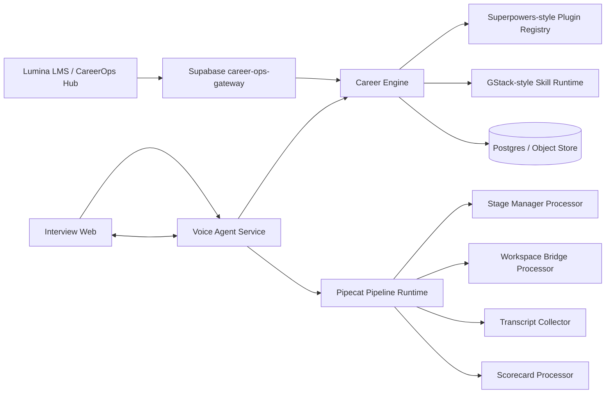

# Lumina Realtime Mock Interview Platform

Production-oriented mock interview platform built as a separate system from the LMS:

- **Career Engine** owns role matching, resume/JD context, interview plans, access codes, attempts, transcripts, scorecards, and reports.
- **Voice Agent Service** owns live Pipecat-style realtime interview orchestration, frame processors, stage transitions, transcript streaming, workspace bridge events, and reconnect recovery.
- **Interview Web** owns the Discord-inspired realtime UX: access code, voice room, transcript, stage rail, collaborative workspace, report preview.
- **Contracts / Skills / Plugins** provide shared schemas, GStack-style skills, and Superpowers-style dynamic runtime capabilities.

The intended feel is:

```txt
Pipecat runtime + GStack skills + Superpowers plugins + Discord-inspired UX
```

## Provider Stack

The realtime AI stack is configured for:

- **Whisper** as STT, using Pipecat `WhisperSTTService`.
- **Mistral** as LLM, using Pipecat `MistralLLMService`.
- **Kokoro** as TTS, using Pipecat `KokoroTTSService`.

Put `MISTRAL_API_KEY` in your local `.env` or deployment secret store. Whisper and Kokoro run locally after their Pipecat extras and model files are installed.

## Quick Start

```powershell
cd C:\Users\S Sameer\Desktop\HOD\lumina-mock-interview-platform
copy .env.example .env
npm install
npm run build
npm run career:dev
npm run dev
cd services\voice-agent
pip install -r requirements.txt
python -m uvicorn app.main:app --reload --host 0.0.0.0 --port 8020
```

For first-time local model setup:

```powershell
cd C:\Users\S Sameer\Desktop\HOD\lumina-mock-interview-platform\services\voice-agent
pip install -r requirements.txt
```

Whisper downloads the selected model, for example `WHISPER_MODEL=base`, on first use. Kokoro downloads/caches ONNX model files on first use.

For a production-style local smoke run, start the built services without file watchers in separate terminals:

```powershell
npm run build
node services\career-engine\dist\server.js
cd services\voice-agent
python -m uvicorn app.main:app --host 0.0.0.0 --port 8020
```

Then run:

```powershell
npm run smoke
```

## Architecture



## Service Ports

- Interview Web: `http://localhost:5174`
- Career Engine: `http://localhost:4010`
- Voice Agent: `http://localhost:8020`

## Design Direction

The interview room uses a Discord-inspired dark cosmic surface, Blurple CTAs, stage/channel rails, status pills, transcript bubbles, and a coding/case workspace that feels like a game-world room rather than a flat form.

## Production Notes

- The visible access code is never a realtime voice token.
- Voice sessions receive short-lived signed tokens after validation.
- Bootstrap payloads are signed using HMAC.
- Runtime callbacks are timestamped and HMAC-signed before transcript, workspace, and report writes are accepted.
- Local Career Engine state is stored in `CAREER_ENGINE_STORE_PATH` and defaults to `.data/career-engine-store.json`.
- Voice Agent exposes a reconnect endpoint that returns the current stage/workspace snapshot for reconnect recovery.
- The Voice Agent should run with Redis or Postgres for reconnect-safe session state in production.
- Pipecat provider integrations are isolated behind runtime adapters so local development can use a deterministic mock pipeline.
