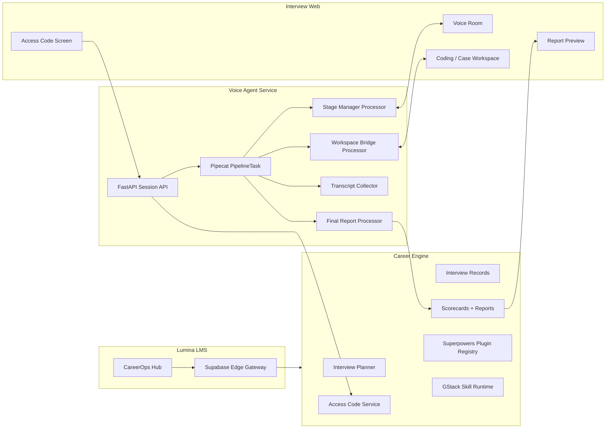

# Realtime Mock Interview Architecture

This platform is intentionally separate from Lumina LMS. Lumina should call it through signed APIs and display the results, but it should not own the live interview runtime.

## System Shape

## Architectural Influences

### Pipecat

The Voice Agent is modeled around frame-pipeline thinking:

- `PipelineFactory` creates a real Pipecat `PipelineTask`.
- `InterviewStageManagerProcessor` controls stage state and candidate turns.
- `WorkspaceBridgeProcessor` emits and receives UI workspace events.
- `TranscriptCollectorProcessor` persists transcript segments.
- `FinalReportProcessor` sends the report callback.

The active provider stack is:

- Whisper for local/offline STT.
- Mistral for LLM reasoning.
- Kokoro for local/offline TTS.

There is no local mock fallback in the voice runtime. Redis, `MISTRAL_API_KEY`, Whisper dependencies, and Kokoro dependencies are required for realtime interviews.

### GStack

Skills are runtime-loadable abilities:

- resume deep dive
- role competency
- coding workspace
- behavioral STAR probe
- scorecard synthesis
- reconnect recovery

Each skill has a scope, prompt addendum, capabilities, and safety rules.

### Superpowers

Plugins expose discovered capabilities and actions:

- Career Engine plugin
- Pipecat Runtime plugin
- Workspace Bridge plugin

The plugin registry is action-oriented and can later load capabilities from package manifests, database rows, or tenant-level plugin config.

## Security Model

- Human access code is short-lived and hashed at rest.
- Voice session token is issued only after access-code validation.
- Bootstrap payloads contain deterministic stage/rubric/workspace contracts.
- Runtime callbacks are timestamped and HMAC-signed before Career Engine accepts transcript, workspace, stage, or report writes.
- Access-code validation is rate-limited per interview and client address.
- Callback payloads are checked against the target interview and attempt before persistence.

## Reconnect Recovery

Production should persist:

- current stage index
- stage start time
- question count
- transcript cursor
- workspace snapshot
- pending UI command queue

Voice Agent runtime state is Redis-backed using `session:{id}`, `transcript:{id}`, `workspace:{id}`, and `stage:{id}` keys. Career Engine records still persist to a local JSON store by default for repeatable local testing.

## Service Boundaries

| Service | Owns | Does Not Own |
|---|---|---|
| Lumina LMS | dashboards, auth, report visibility | live voice runtime |
| Career Engine | role/resume/JD/interview data, reports | microphone transport |
| Voice Agent | realtime orchestration, pipeline, transcript streaming | long-term records |
| Interview Web | candidate realtime UX | scoring authority |

## Remaining Production Hardening Checklist

- Replace in-memory Career Engine store with Postgres.
- Add sandboxed code execution for coding interviews.
- Add OpenTelemetry spans around pipeline stages.
- Add WebRTC transport adapter for browser microphone/audio transport.
- Add signed object storage for transcript/report exports.
